# Architecture
{: .no_toc }

Deep dive into Rustberg's internal architecture and design decisions.
{: .fs-6 .fw-300 }

## Table of Contents
{: .no_toc .text-delta }

1. TOC
{:toc}

---

## System Overview

Rustberg is built as a modular, layered architecture designed for security, performance, and extensibility.

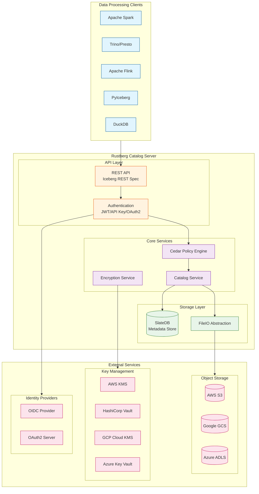

---

## Request Flow

Every request follows a strict security pipeline before reaching the catalog logic.

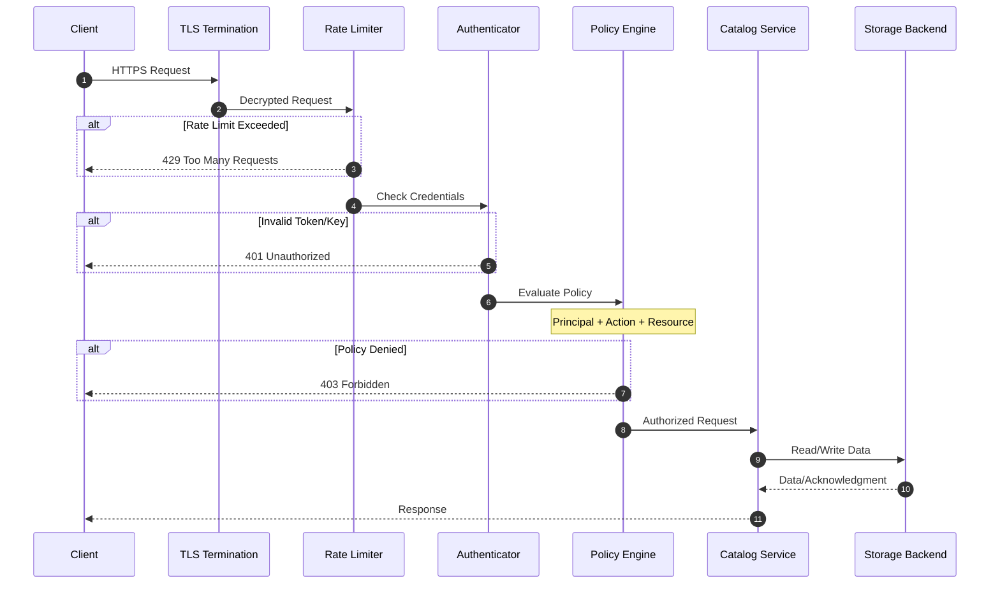

---

## Authentication Flow

### JWT/OIDC Authentication

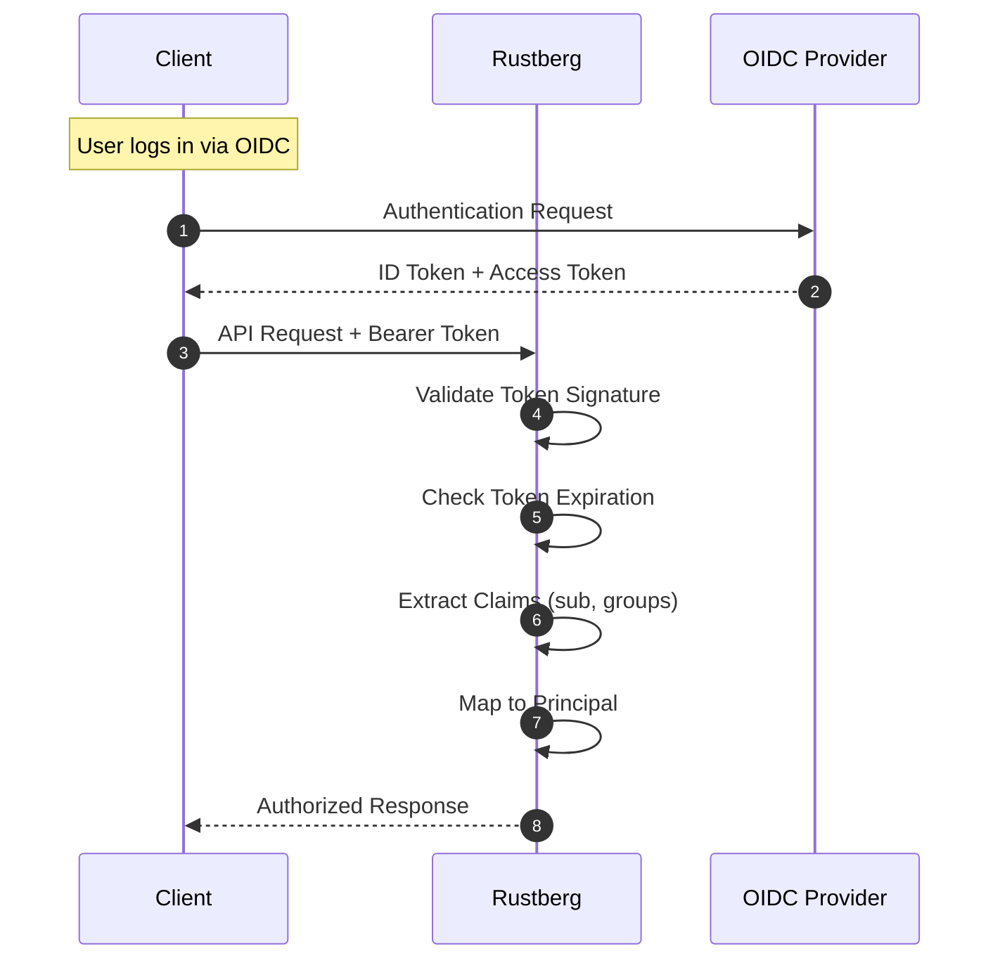

### API Key Authentication

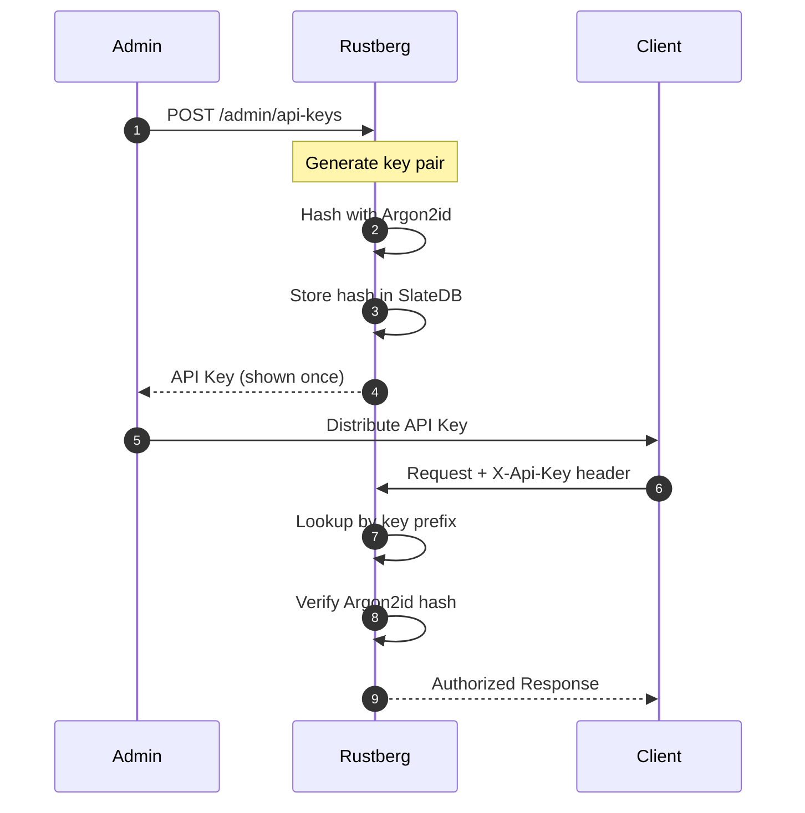

---

## Authorization Model

### Cedar Policy Evaluation

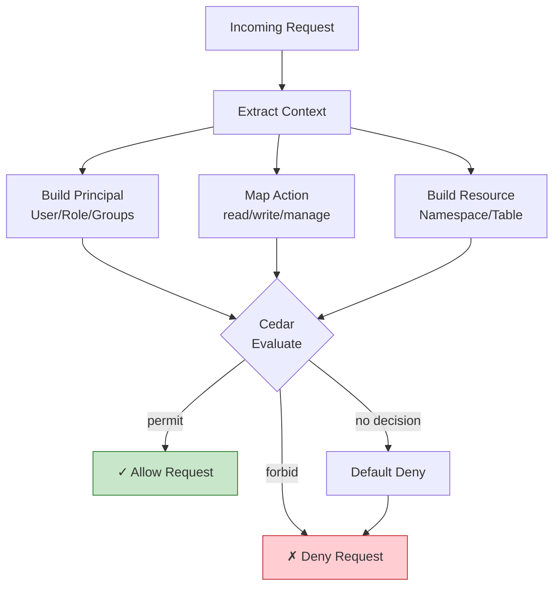

### Policy Structure

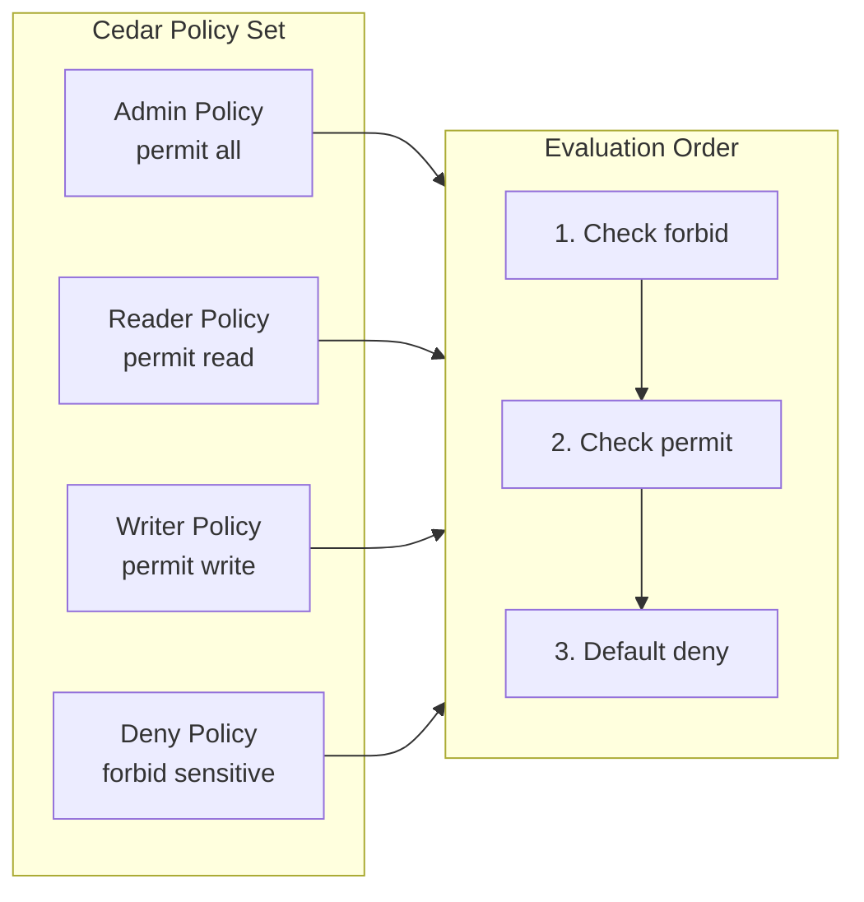

---

## Encryption Architecture

### Envelope Encryption

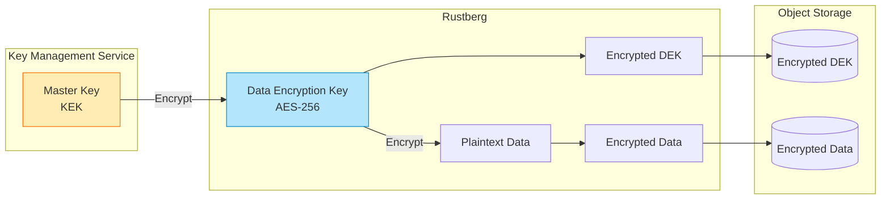

### Encryption Flow

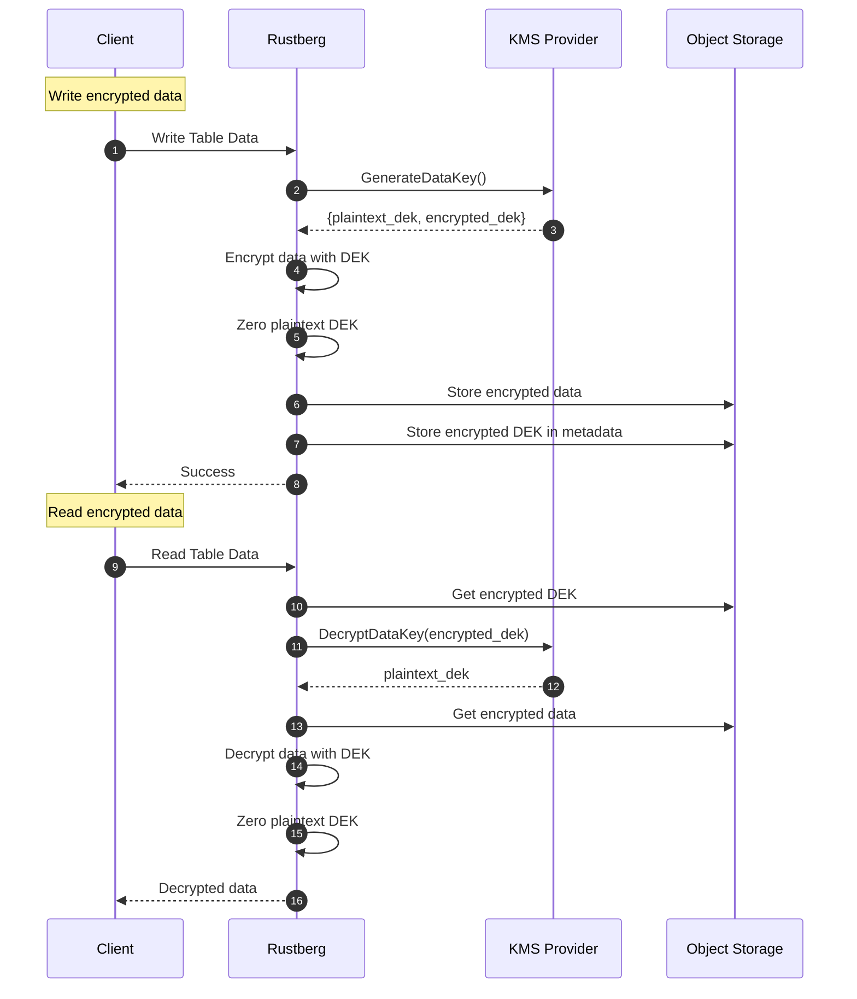

---

## Storage Architecture

### SlateDB for Metadata

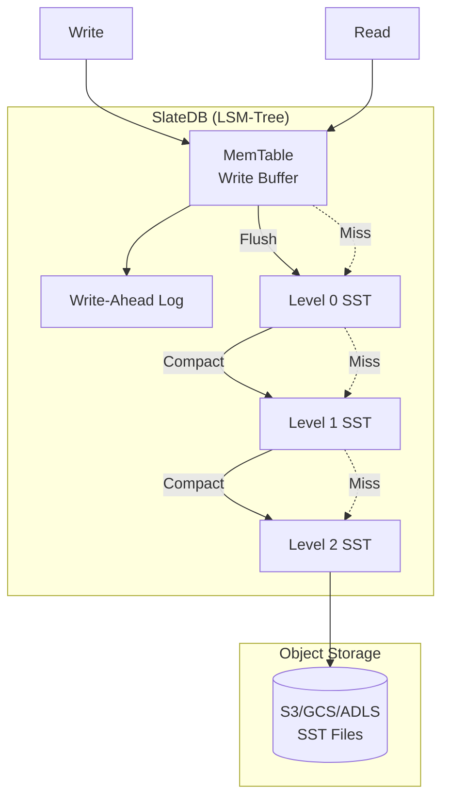

### Table Metadata Structure

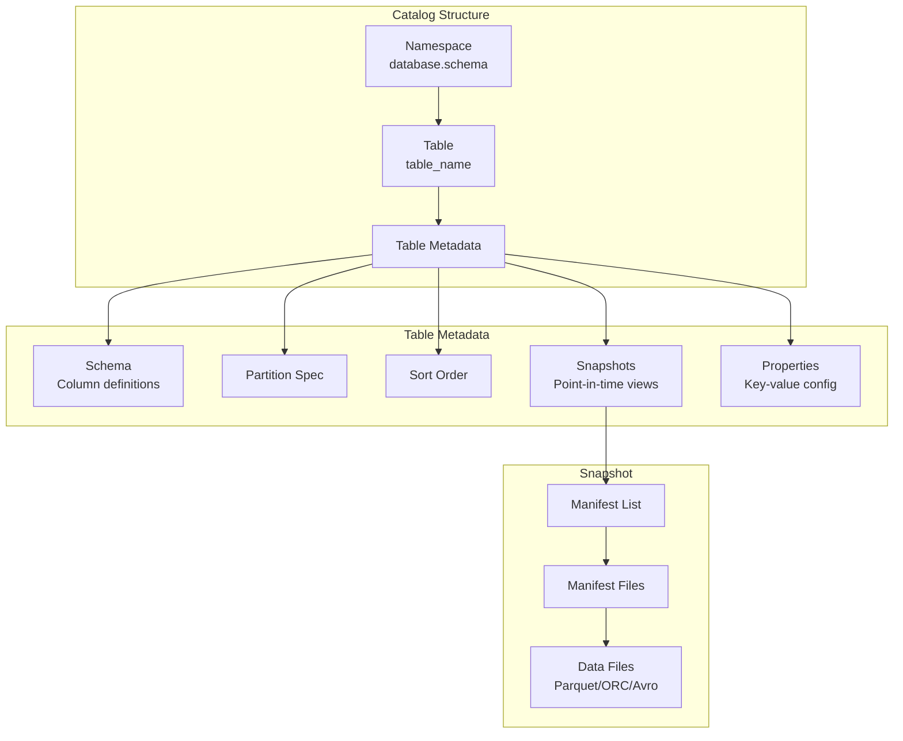

---

## High Availability

### Multi-Region Deployment

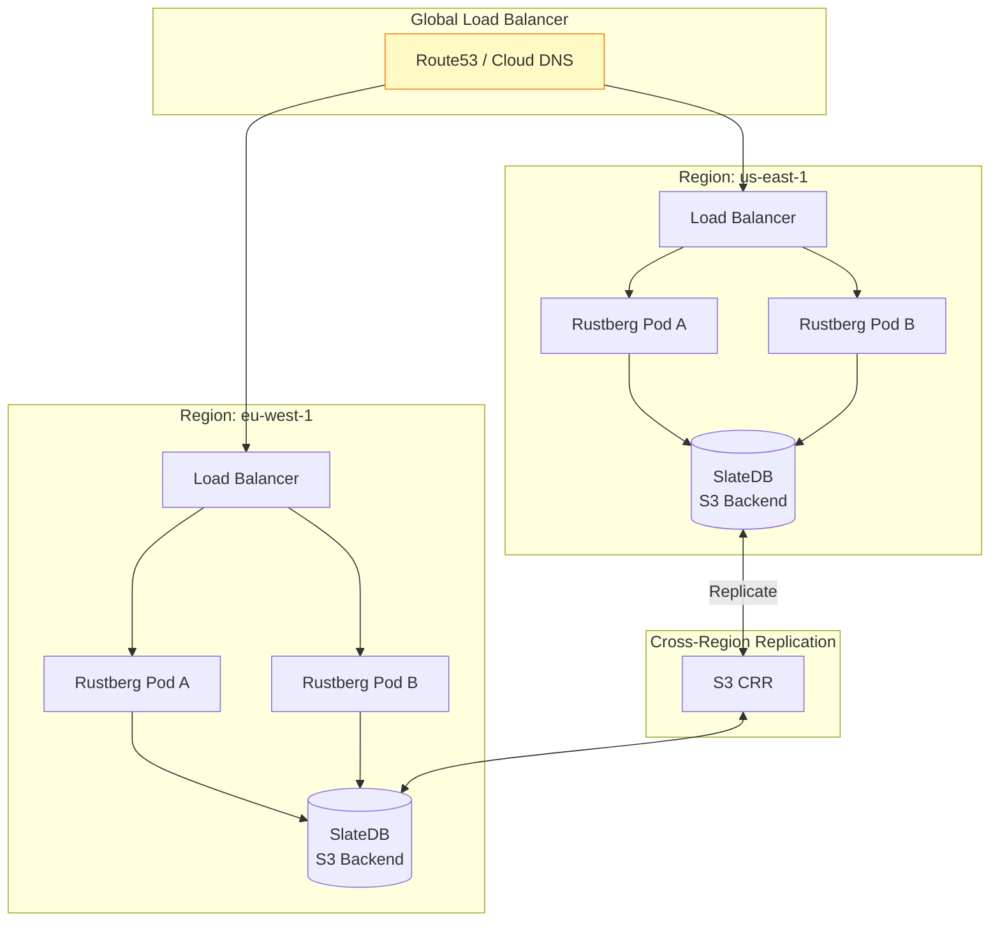

---

## Performance Characteristics

### Latency Breakdown

| Operation | Typical Latency | Notes |
|-----------|-----------------|-------|
| Authentication | 1-5ms | JWT validation, API key lookup |
| Policy Evaluation | <1ms | Cedar is extremely fast |
| Metadata Read | 5-20ms | SlateDB cache hit |
| Metadata Write | 10-50ms | Includes WAL sync |
| Table Creation | 50-200ms | Includes storage setup |

### Throughput Estimates

| Deployment | Read QPS | Write QPS | Memory |
|------------|----------|-----------|--------|
| Single Pod | 10,000 | 1,000 | 512MB |
| 3-Pod Cluster | 30,000 | 3,000 | 1.5GB |
| Production HA | 100,000+ | 10,000+ | 8GB+ |

---

## Component Dependencies

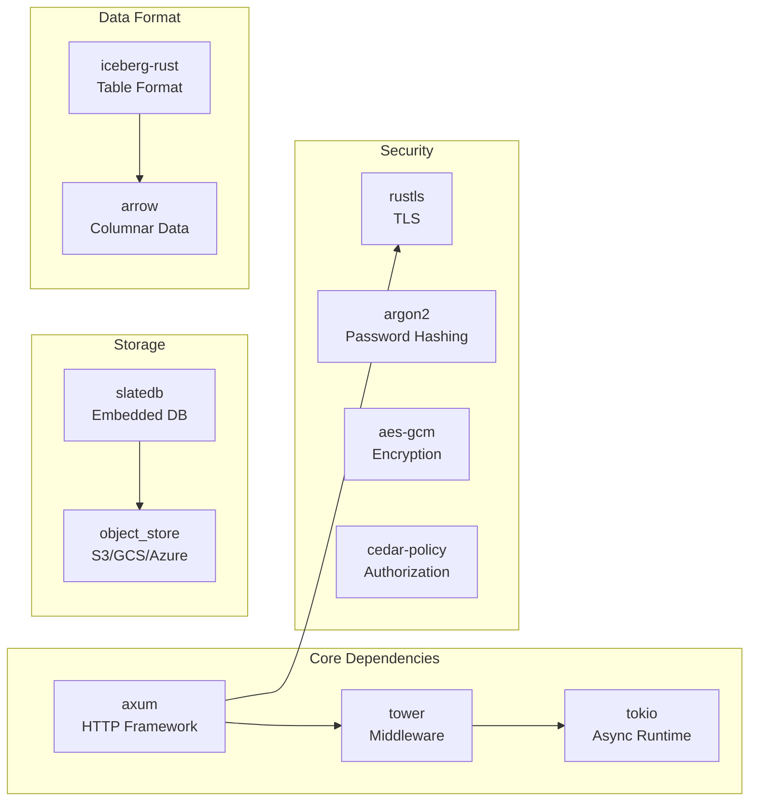

---

## Design Decisions

### Why SlateDB?

1. **Cloud-Native**: SST files stored directly in object storage
2. **No Operational Overhead**: No separate database to manage
3. **Cost-Effective**: Pay only for storage, not compute
4. **Durable**: Data survives pod restarts

### Why Cedar?

1. **Expressiveness**: Supports complex ABAC policies
2. **Performance**: Microsecond-level evaluation
3. **Safety**: Formal verification available
4. **Auditability**: Policies are human-readable

### Why Envelope Encryption?

1. **Key Isolation**: Master keys never leave KMS
2. **Performance**: Bulk encryption with local DEK
3. **Rotation**: Rotate master key without re-encrypting data
4. **Compliance**: Meets FIPS 140-2 requirements

---

## Security Layers

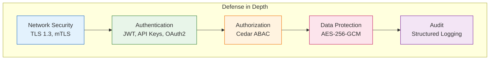
