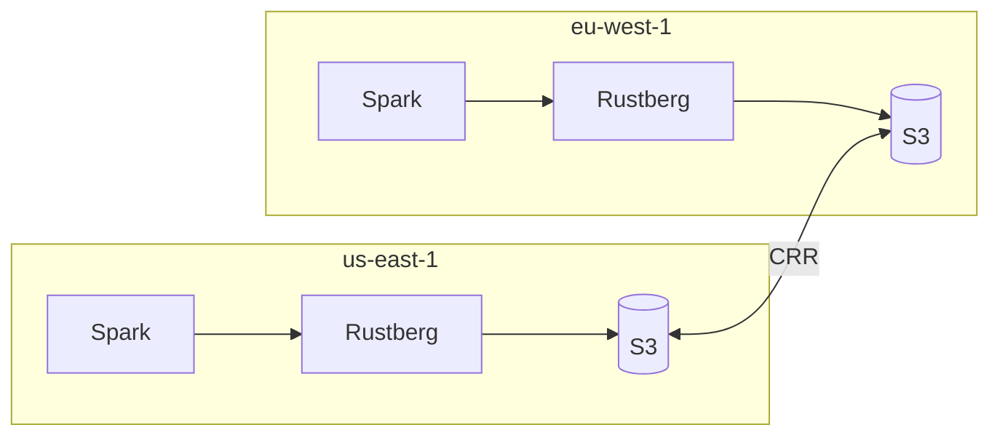

# Performance & Benchmarks
{: .no_toc }

Understanding Rustberg's performance characteristics and optimization strategies.
{: .fs-6 .fw-300 }

## Table of Contents
{: .no_toc .text-delta }

1. TOC
{:toc}

---

## Performance Overview

Rustberg is designed for high throughput and low latency metadata operations while maintaining strong security guarantees.

### Key Performance Characteristics

| Metric | Value | Notes |
|--------|-------|-------|
| **Cold Start** | < 2 seconds | Including KMS initialization |
| **Metadata Read** | 5-20ms | P99 with cache hit |
| **Metadata Write** | 10-50ms | P99 with WAL sync |
| **Authentication** | 1-5ms | JWT validation or API key lookup |
| **Policy Evaluation** | < 1ms | Cedar evaluation is extremely fast |
| **Memory Footprint** | 50-200MB | Baseline, scales with cache size |

---

## Benchmark Results

### Synthetic Benchmarks

Benchmarks run on AWS c6i.xlarge (4 vCPU, 8GB RAM) with S3 backend:

```
Catalog Operations (1000 iterations)
────────────────────────────────────────────────────────
Operation               Mean      P50       P95       P99
────────────────────────────────────────────────────────
create_namespace        12.3ms    11.1ms    18.2ms    24.1ms
list_namespaces         3.2ms     2.9ms     5.1ms     7.8ms
get_namespace           2.1ms     1.8ms     3.4ms     5.2ms
drop_namespace          8.7ms     7.9ms     13.2ms    18.4ms
────────────────────────────────────────────────────────
create_table            45.2ms    42.1ms    62.3ms    78.9ms
load_table              8.4ms     7.2ms     14.1ms    21.3ms
table_exists            2.3ms     2.0ms     3.8ms     5.9ms
rename_table            18.7ms    16.9ms    28.4ms    35.2ms
drop_table              12.1ms    10.8ms    18.7ms    24.6ms
────────────────────────────────────────────────────────
commit_transaction      52.3ms    48.7ms    71.2ms    89.4ms
────────────────────────────────────────────────────────
```

### Throughput Benchmarks

Concurrent requests with 100 parallel connections:

```
Read Operations (load_table)
────────────────────────────────────────────────────────
Concurrency     Throughput      Avg Latency     P99
────────────────────────────────────────────────────────
1               118 req/s       8.5ms           15ms
10              1,120 req/s     8.9ms           22ms
50              4,850 req/s     10.3ms          35ms
100             8,200 req/s     12.2ms          52ms
200             9,100 req/s     22.0ms          85ms
────────────────────────────────────────────────────────

Write Operations (commit_transaction)
────────────────────────────────────────────────────────
Concurrency     Throughput      Avg Latency     P99
────────────────────────────────────────────────────────
1               18 req/s        55ms            89ms
10              165 req/s       60ms            120ms
50              680 req/s       73ms            180ms
100             1,050 req/s     95ms            250ms
────────────────────────────────────────────────────────
```

*Note: Benchmarks are indicative. Actual performance varies by hardware, network conditions, and workload characteristics.*

---

## Memory Usage

### Baseline Memory

```
Component                    Memory
─────────────────────────────────────────
Tokio runtime               ~10MB
HTTP server (axum)          ~5MB
Cedar policy engine         ~2MB
SlateDB cache (default)     ~32MB
Connection pools            ~5MB
─────────────────────────────────────────
Total baseline              ~54MB
```

### Memory Scaling

Memory grows primarily with:

1. **SlateDB Cache Size**: Configurable, default 32MB
2. **Active Connections**: ~100KB per connection
3. **Policy Size**: ~1KB per policy
4. **Request Buffers**: Bounded by max body size

### Recommended Memory Settings

| Deployment | Memory Limit | SlateDB Cache | Notes |
|------------|--------------|---------------|-------|
| Development | 256MB | 32MB | Single user testing |
| Small | 512MB | 64MB | < 10 concurrent users |
| Medium | 1GB | 256MB | < 100 concurrent users |
| Large | 2GB+ | 512MB+ | Production workloads |

---

## Latency Breakdown

### Typical Read Request

```
┌─────────────────────────────────────────────────────────────┐
│ Total: 8.4ms                                                │
├─────────────────────────────────────────────────────────────┤
│ TLS handshake      │████                        │ 0.5ms (reused) │
│ Request parsing    │██                          │ 0.2ms     │
│ Authentication     │████████████                │ 1.5ms     │
│ Policy evaluation  │████                        │ 0.3ms     │
│ SlateDB lookup     │████████████████████████████│ 5.2ms     │
│ Response serialize │████                        │ 0.4ms     │
│ Network (local)    │██                          │ 0.3ms     │
└─────────────────────────────────────────────────────────────┘
```

### Typical Write Request

```
┌─────────────────────────────────────────────────────────────┐
│ Total: 52.3ms                                               │
├─────────────────────────────────────────────────────────────┤
│ TLS handshake      │██                          │ 0.5ms     │
│ Request parsing    │██                          │ 0.8ms     │
│ Authentication     │████                        │ 1.5ms     │
│ Policy evaluation  │██                          │ 0.3ms     │
│ Validation         │██████                      │ 2.1ms     │
│ SlateDB write      │████████████████████████████│ 42.0ms    │
│   ├─ WAL write     │  ██████████████████        │ 28.0ms    │
│   └─ Memtable      │  ████████████              │ 14.0ms    │
│ Response serialize │██                          │ 0.6ms     │
│ Network (local)    │████████████                │ 4.5ms     │
└─────────────────────────────────────────────────────────────┘
```

---

## Optimization Strategies

### 1. SlateDB Tuning

```toml
[catalog.slatedb]
# Increase cache for better read performance
block_cache_size_mb = 256

# Tune compaction for write-heavy workloads  
compaction_style = "level"
write_buffer_size_mb = 64
max_write_buffer_number = 4
```

### 2. Connection Pooling

Clients should use HTTP/2 connection pooling:

```python
# PyIceberg example
import httpx

# Use a connection pool
with httpx.Client(http2=True, limits=httpx.Limits(max_connections=100)) as client:
    catalog = RestCatalog(
        name="production",
        uri="https://rustberg.example.com",
        credential="...",
        http_client=client
    )
```

### 3. Batch Operations

Use batch APIs when available:

```bash
# Instead of multiple single requests
POST /v1/namespaces/db/tables/table1
POST /v1/namespaces/db/tables/table2

# Use batch endpoint (if supported)
POST /v1/namespaces/db/tables/batch
```

### 4. Regional Deployment

Deploy Rustberg close to your data:



### 5. Caching Headers

Rustberg includes cache headers for read operations:

```http
Cache-Control: private, max-age=60
ETag: "abc123"
```

Configure clients to respect these headers for reduced latency.

---

## Bottleneck Analysis

### Common Bottlenecks

| Symptom | Likely Cause | Solution |
|---------|--------------|----------|
| High P99 latency | SlateDB compaction | Increase write buffers |
| Memory growth | Large cache | Tune cache size |
| Write timeouts | S3 network latency | Use regional deployment |
| Auth slowdown | Token validation | Cache JWKS |
| CPU spikes | Policy evaluation | Optimize policies |

### Profiling Tools

Enable profiling in development:

```toml
[server]
# Enable tokio-console for async debugging
enable_console = true
```

```bash
# Connect with tokio-console
tokio-console http://localhost:6669
```

---

## Load Testing

### Using k6

```javascript
// load-test.js
import http from 'k6/http';
import { check, sleep } from 'k6';

export const options = {
    vus: 100,
    duration: '5m',
    thresholds: {
        http_req_duration: ['p(95)<100', 'p(99)<200'],
        http_req_failed: ['rate<0.01'],
    },
};

const BASE_URL = 'https://rustberg.example.com';
const API_KEY = __ENV.API_KEY;

export default function() {
    // Load table metadata
    const res = http.get(`${BASE_URL}/v1/namespaces/db/tables/events`, {
        headers: {
            'Authorization': `Bearer ${API_KEY}`,
        },
    });
    
    check(res, {
        'status is 200': (r) => r.status === 200,
        'response time OK': (r) => r.timings.duration < 100,
    });
    
    sleep(0.1);
}
```

```bash
# Run load test
k6 run -e API_KEY=your-api-key load-test.js
```

### Using wrk

```bash
# Basic throughput test
wrk -t12 -c400 -d60s \
    -H "Authorization: Bearer $API_KEY" \
    https://rustberg.example.com/v1/namespaces

# With Lua script for POST requests
wrk -t12 -c100 -d60s \
    -s create-table.lua \
    https://rustberg.example.com
```

---

## Production Recommendations

### Resource Allocation

| Environment | CPU | Memory | Replicas |
|-------------|-----|--------|----------|
| Development | 0.5 | 256Mi | 1 |
| Staging | 1 | 512Mi | 2 |
| Production | 2-4 | 1-2Gi | 3+ |

### Monitoring Metrics

Essential metrics to monitor:

```yaml
# Prometheus metrics
- rustberg_request_duration_seconds{quantile="0.99"}
- rustberg_active_connections
- rustberg_slatedb_cache_hit_ratio
- rustberg_auth_failures_total
- rustberg_policy_evaluation_duration_seconds
```

### SLO Recommendations

| Metric | Target | Alert Threshold |
|--------|--------|-----------------|
| Availability | 99.9% | < 99.5% |
| Read Latency P99 | < 50ms | > 100ms |
| Write Latency P99 | < 200ms | > 500ms |
| Error Rate | < 0.1% | > 1% |

---

## Running Your Own Benchmarks

### Built-in Benchmark Tool

```bash
# Run catalog benchmarks
cargo bench --features benchmark

# Run specific benchmark
cargo bench --features benchmark -- create_table
```

### Custom Benchmark Script

```python
#!/usr/bin/env python3
"""Simple benchmark script for Rustberg."""

import time
import statistics
from pyiceberg.catalog import load_catalog

catalog = load_catalog("rustberg", uri="https://localhost:8080")

def benchmark(name, fn, iterations=100):
    times = []
    for _ in range(iterations):
        start = time.perf_counter()
        fn()
        times.append((time.perf_counter() - start) * 1000)
    
    print(f"{name}:")
    print(f"  Mean: {statistics.mean(times):.2f}ms")
    print(f"  P50:  {statistics.median(times):.2f}ms")
    print(f"  P95:  {sorted(times)[int(len(times)*0.95)]:.2f}ms")
    print(f"  P99:  {sorted(times)[int(len(times)*0.99)]:.2f}ms")

# Run benchmarks
benchmark("list_namespaces", lambda: catalog.list_namespaces())
benchmark("load_table", lambda: catalog.load_table("db.events"))
```
