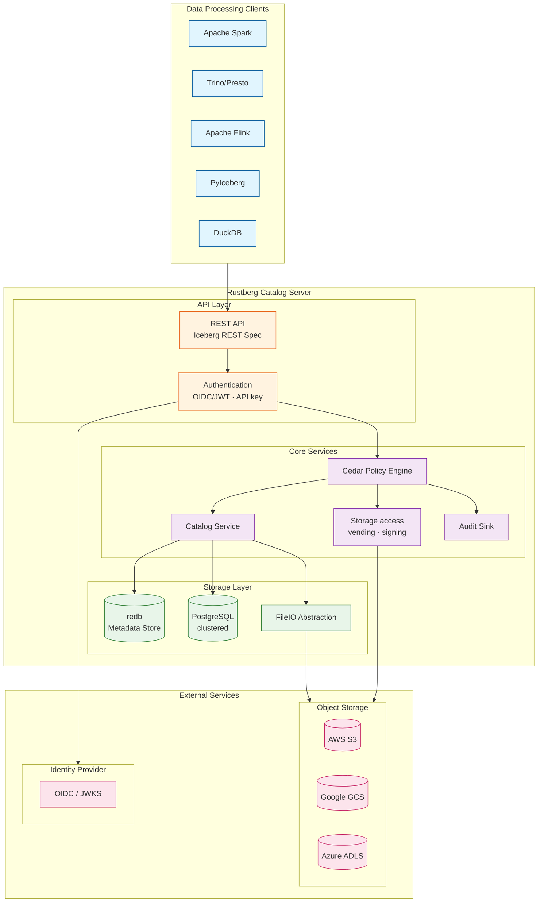
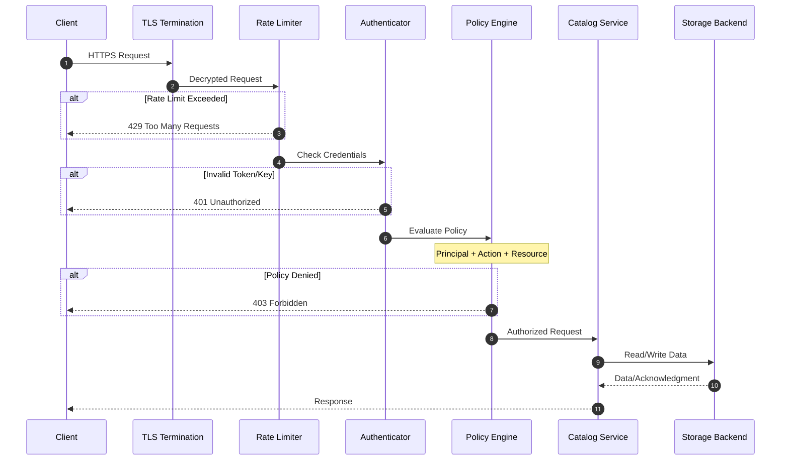
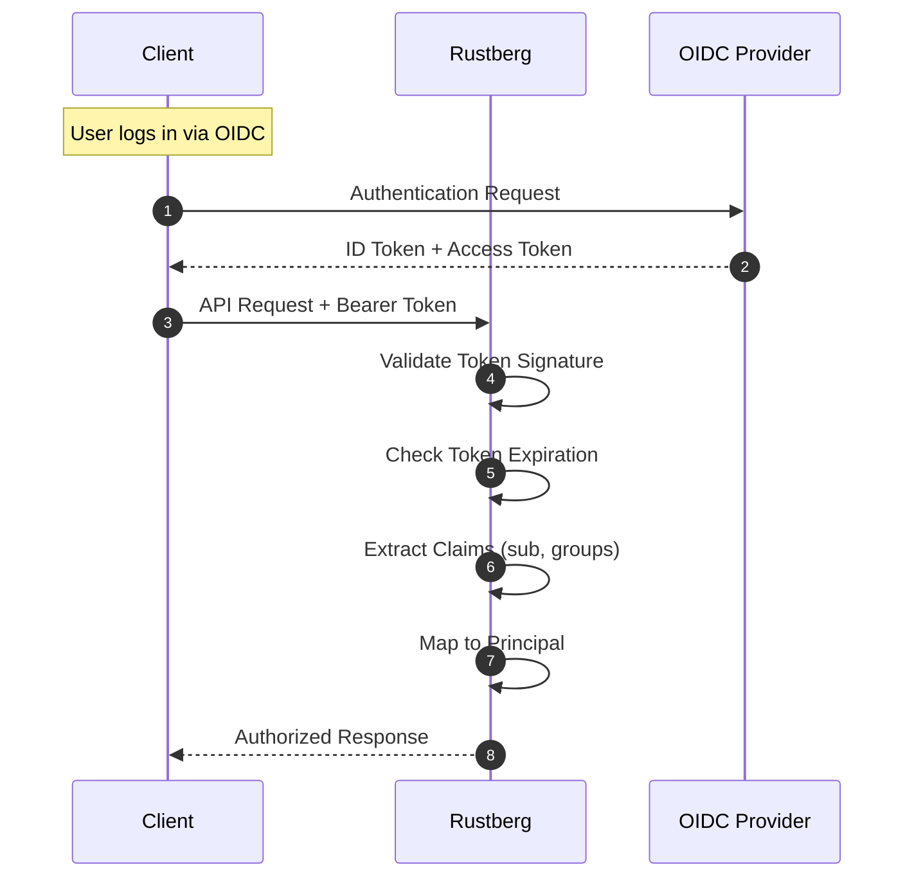
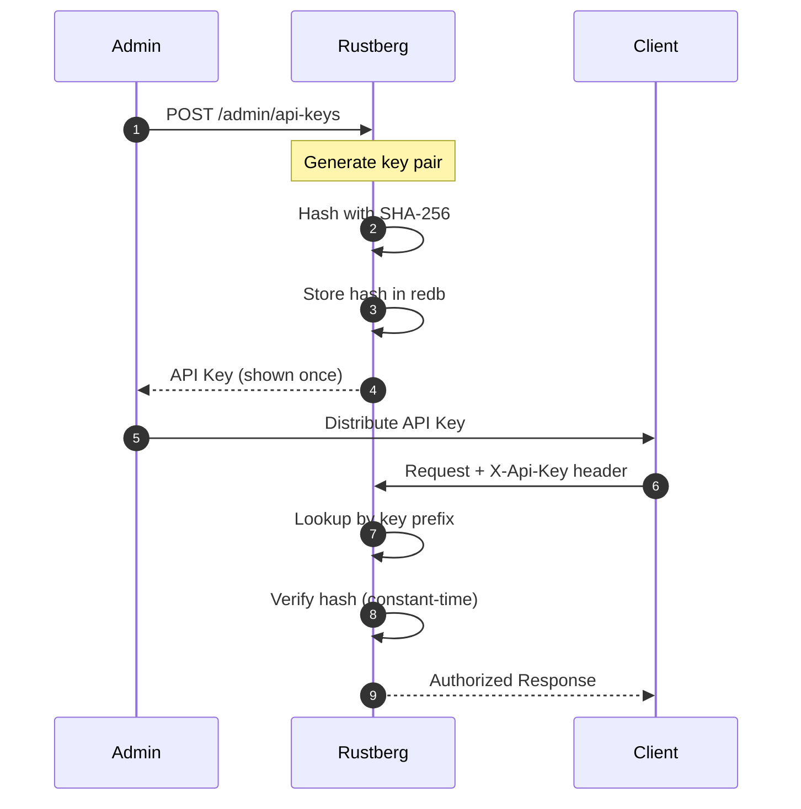
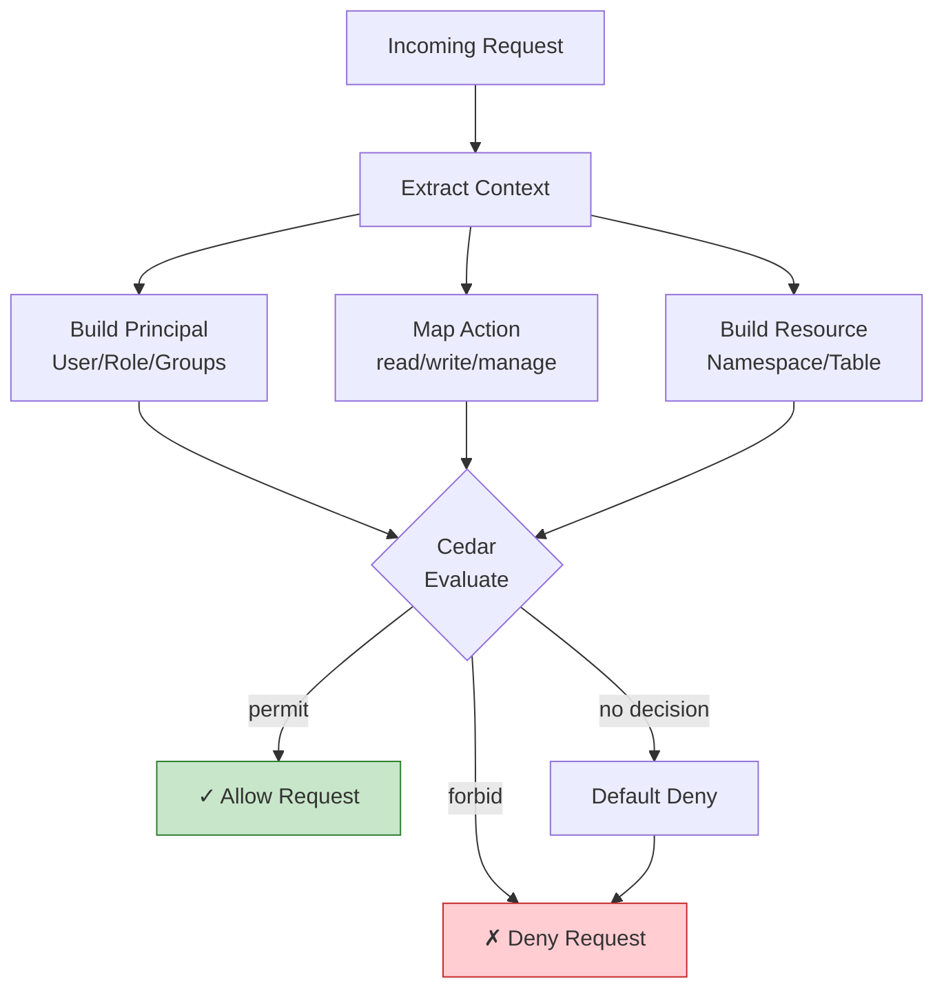
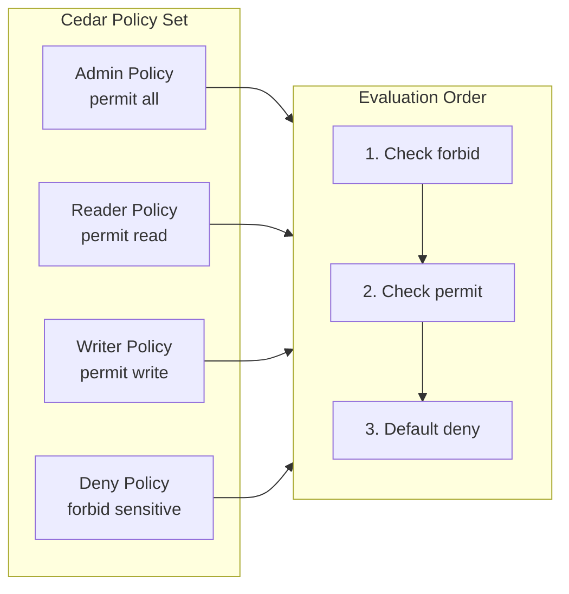
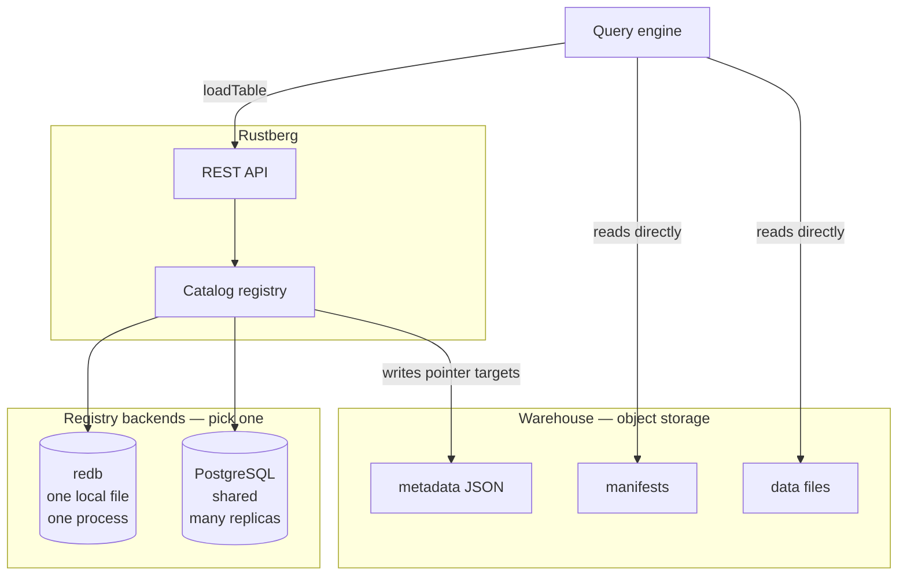
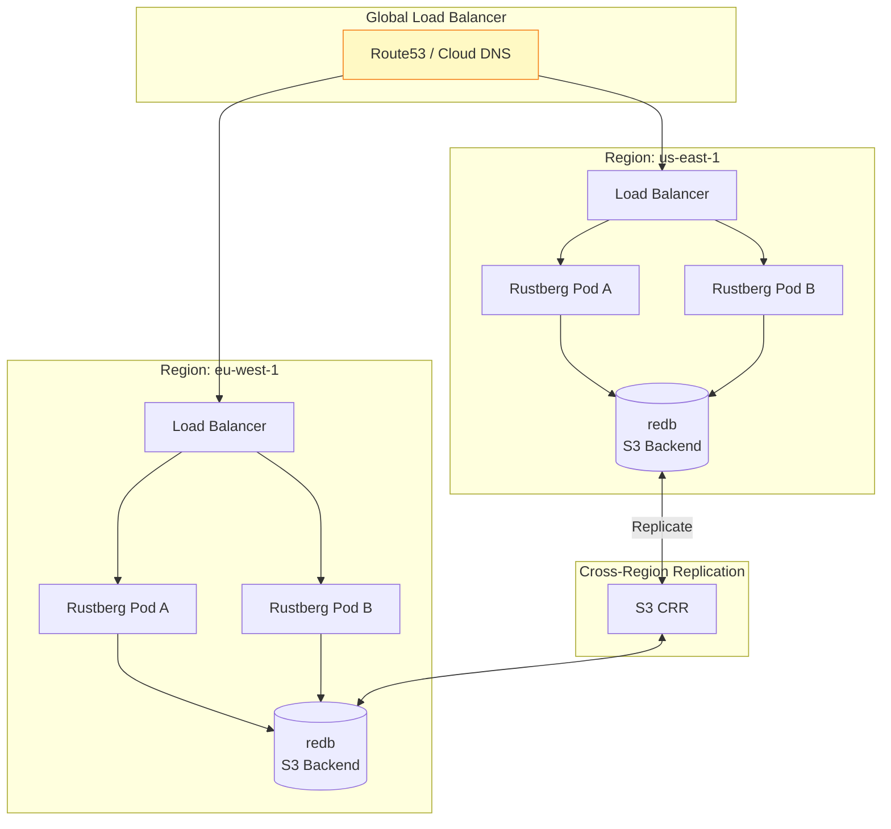
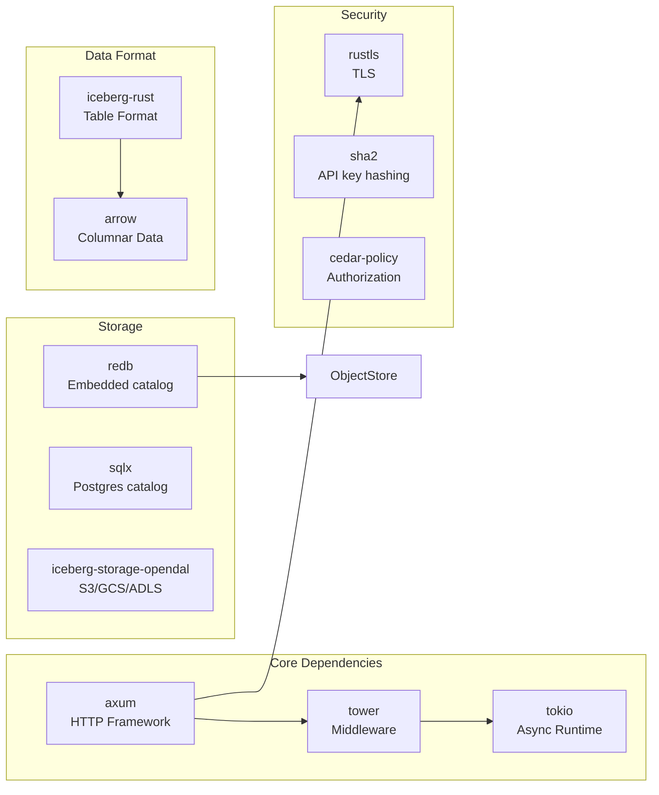
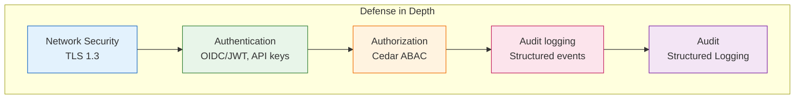

+++
title = "Architecture"
description = "How a request flows through Rustberg: identity, routing, policy, the catalog, credentials, audit."
weight = 2
+++
## System Overview

Rustberg is built as a modular, layered architecture designed for security, performance, and extensibility.



---

## Request Flow

Every request follows a strict security pipeline before reaching the catalog logic.



---

## Authentication Flow

### JWT/OIDC Authentication



### API Key Authentication



---

## Authorization Model

### Cedar Policy Evaluation



### Policy Structure



---

## Storage Architecture

### Catalog backends

The catalog is a *registry*: one metadata-file pointer per table. It is
deliberately small, because everything an engine actually reads lives in the
warehouse and is fetched directly.



Both backends implement the same commit protocol:

1. Read the current pointer and metadata; check the request's requirements.
2. Apply the updates and write a **new** metadata file under a fresh name —
   never overwriting the old one.
3. Swap the pointer, conditional on it still holding the value read in step 1.

Step 3 is the compare-and-swap that makes lost updates impossible: in redb it is
a serializable write transaction, in Postgres a conditional `UPDATE` inside a
SQL transaction. A swap that matches nothing means another writer got there
first, and the commit retries with backoff.

---

## High Availability

### Multi-Region Deployment



---

## Performance Characteristics

### Latency Breakdown

| Operation | Typical Latency | Notes |
|-----------|-----------------|-------|
| Authentication | 1-5ms | JWT validation, API key lookup |
| Policy Evaluation | <1ms | Cedar is extremely fast |
| Metadata Read | 5-20ms | redb cache hit |
| Metadata Write | 10-50ms | Includes WAL sync |
| Table Creation | 50-200ms | Includes storage setup |

### Throughput Estimates

| Deployment | Read QPS | Write QPS | Memory |
|------------|----------|-----------|--------|
| Single Pod | 10,000 | 1,000 | 512MB |
| 3-Pod Cluster | 30,000 | 3,000 | 1.5GB |
| Production HA | 100,000+ | 10,000+ | 8GB+ |

---

## Component Dependencies



---

## Design Decisions

### Why two catalog backends?

**redb** for the embedded case: an ACID, multi-key, single-file database with no
C dependencies, so the binary still cross-compiles statically to musl. No
database to run, and a commit is a local transaction.

**Postgres** for the clustered case: redb takes an exclusive file lock, so it
cannot back more than one process. Postgres lets replicas share one registry
without Rustberg needing leader election or a consensus protocol of its own.

### Why a `CatalogStore` trait instead of `iceberg::Catalog`?

Both registries implement Rustberg's own `CatalogStore`, not `iceberg::Catalog`.
That is deliberate, and it is not a preference:

- **A server cannot commit through `iceberg::Catalog`.** The only commit method is
  `update_table(TableCommit)`, and `TableCommit` has private fields with a
  `pub(crate)` build method. Upstream declined to open it — *"users are not
  supposed to build `TableCommit` directly"* — and directs callers to
  `Transaction`, which derives requirements from typed actions. A REST server is
  handed `(requirements, updates)` verbatim and must apply exactly those, so that
  is the wrong direction.
- **The trait has no views.** Not one view method.
- **The trait cannot page.** `list_tables` returns a `Vec` with no cursor, so a
  backend cannot answer a page even though both registries store tables in a
  sorted index that can.

These are properties of the trait, so no other implementation — `sql`, `rest`,
`glue`, `s3tables` — escapes them. The `iceberg` crate is still used for
everything it does well: `TableMetadata`, `Table`, `ViewMetadata`, `FileIO`,
`TableRequirement::check`, `drop_table_data`, and `iceberg-storage-opendal` for
cloud object stores. Only the registry is written here.

Lakekeeper, the closest comparable project, reached the same conclusion and
defines its own catalog trait for the same reasons.

Federated backends will wrap somebody else's `iceberg::Catalog` *client* behind
`CatalogStore`; such a mount is read-only and reports `views: false`, because the
upstream trait cannot express a commit or a view.

### Why Cedar?

1. **Expressiveness**: Supports complex ABAC policies
2. **Performance**: Microsecond-level evaluation
3. **Safety**: Formal verification available
4. **Auditability**: Policies are human-readable

## Known Limitations

### Concurrency & Atomicity

| Operation | Status | Notes |
|-----------|--------|-------|
| Table Commit | ✅ CAS with version numbers | Returns 409 Conflict on concurrent modification |
| Table Rename | Atomic | One write transaction: the destination is inserted and the source removed together |
| Multi-table Transaction | Atomic | Every pointer swaps in one write transaction, re-verifying each version inside it |

**Optimistic concurrency control:** every commit swaps the metadata pointer
conditionally on the value it read. Rustberg retries a lost swap internally with
jittered backoff; a commit whose *requirements* no longer hold is not retried but
returned as `409 Conflict`, since re-running it would not help. This works the
same whether the registry is redb or Postgres — see
[deployment topology](#concurrency-and-deployment-topology).

**Multi-table atomicity:** `commit_tables_atomic` gives all-or-nothing semantics
across tables — one redb write transaction, or one SQL transaction with a
conditional `UPDATE` per table. If any table's pointer moved underneath, the
whole transaction rolls back and the commit retries, so no client observes a
half-applied transaction.

### Persistence

| Component | Where it lives | Survives a restart? |
|-----------|----------------|---------------------|
| Namespaces | Catalog registry (redb or Postgres) | Yes |
| Tables | Catalog registry + metadata files | Yes |
| Views | Catalog registry + metadata files | Yes |
| Idempotency receipts | Postgres, when the catalog is Postgres; otherwise in memory | With Postgres |
| API keys | Configuration, hashed in memory | **No** — they come from config or the environment on every start |

All *catalog metadata* persists. The rest is deliberate:

- **API keys are configuration, not state.** They arrive from a config file or a
  mounted secret and are hashed at startup, so there is no key store to encrypt,
  back up, or guard with a "who may mint keys" policy. Rotation is a config change.
  The trade is that revocation needs a restart; deployments that need runtime
  revocation use OIDC, where token lifetime belongs to the identity provider.
- **Idempotency receipts follow the catalog.** On Postgres they live in the same
  database, so a retry that lands on another replica is replayed rather than
  executed twice. On redb there is nothing to share: the file takes an exclusive
  lock, so there is only ever one process.

### Concurrency and deployment topology

Deployment topology follows from the catalog backend.

#### Postgres: many replicas

Replicas share one registry, so they are ordinary stateless pods — any number,
rolling updates, autoscaling. There is no leader election because there is no
leader: correctness comes from the conditional `UPDATE` in step 3 of the commit
protocol above. Two replicas committing to the same table concurrently both
succeed, one after retrying.

Idempotency receipts live in the same database, so a retry landing on a
different pod is replayed from the first response rather than executed twice.

#### redb: exactly one process

redb holds an exclusive lock on the catalog file. A second process does not
contend or corrupt — it fails to open the database:

```text
Failed to open redb catalog: Database already open. Cannot acquire lock.
```

That is a clean failure, and it means `replicas: 1` with `strategy: Recreate`.
A rolling update would start the new pod before the old one exits, and the new
pod could not open the file.

```
        ┌─────────────┐            ┌─────────────┐
        │  Rustberg   │            │  Rustberg   │  ✗ cannot start
        │ (replicas:1)│            │             │
        └──────┬──────┘            └──────┬──────┘
               │                          │
          ┌────▼──────────────────────────▼────┐
          │        catalog.redb (locked)       │
          └────────────────────────────────────┘
```

If you need more than one replica, that is what the Postgres backend is for.

#### Concurrent commits

Concurrency *inside* the process is handled properly. Commits run in a redb
serializable-snapshot transaction: the registry entry is read and swapped inside
one transaction, so a concurrent commit that touched the same table aborts rather
than silently overwriting.

- Two requests read version 5 and each build new metadata.
- The first commits; the entry becomes version 6.
- The second's transaction conflicts and is rejected with `409 Conflict`.

Clients should retry `409` with exponential backoff — the standard Iceberg
optimistic-commit contract.

#### Scaling reads

Not on redb. The exclusive lock is on the *file*, not on write access, so a
second process cannot open it read-only either. Scaling out means the Postgres
catalog.

## Security Layers


